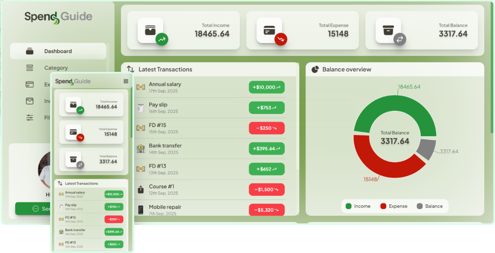

<!-- Logo -->
# **Backend of**


<div style="display: flex; align-items: center; justify-content: center;">

[](https://render.com/)
[](LICENSE)

</div>

#

<!-- Screenshots -->
<div 
    style="display:flex; flex-direction: column; align-items: center; justify-content: between; width: 100%;padding-bottom: 65px;" 
>
    <div style="display:flex; flex-direction: column; align-items: center; justify-content: between; width: 100%;">
        
    </div>
</div>

## This repo contains the **backend** of the **Spend Guide** application built with **Spring Boot**
It provides a REST API with user authentication and provides income, expense report, also categories them by their type for staying organised.

Check out the live demo of the app: [Spend Guide↗](https://spend-guide.netlify.app/)
> **IMP**: Might took some time(around 2-3 mins) for first response in a while from the backend due to the limitation of [Render↗](https://render.com/) free instance. <br>
> If you want, you can check if the **backend server is up or not** by visiting: [Test Spend Guide↗](https://spend-guide.onrender.com/api/v1/health)


Also, check out the frontend repo of the app: [Spend Guide frontend repo↗](https://github.com/Manideep-X/Spend-Guide-Frontend)

- ### Features:

    1. User authentication with their **credentials** and **JWT**.
    2. CRUD operations for **income**, **expense** and **category tracking**
    3. Generates **daily/monthly reports** of spending details.
    4. **Exports data as excel** file for download or for sending email.
    5. **Email integration** for scheduled/immediate report sending.
    6. **CORS** setup for react.js frontend

---

- ### Tech stack used:

    * [](https://docs.oracle.com/en/java/javase/24/)
    * [](https://docs.spring.io/spring-boot/index.html)
    * [](https://mvnrepository.com/artifact/io.jsonwebtoken/jjwt-api)
    * [](https://maven.apache.org/)
    * [](https://mvnrepository.com/artifact/org.apache.poi/poi-ooxml)
    * [-%23316192.svg?style=for-the-badge&logo=postgresql&logoColor=white)](https://www.postgresql.org/docs/)
    * [-4479A1.svg?style=for-the-badge&logo=mysql&logoColor=white)](https://dev.mysql.com/doc/)
    * [](https://www.brevo.com/)

---

- ### Local Installation and Setup Guide:

    1. Clone the repository:
        ```
            git clone https://github.com/<your_username>/spend-guide-backend.git
        ```

    2. Configure the ```application.properties``` file:
        - Change the properties profile from production to local:
            From ```spring.profiles.active=production``` to ```spring.profiles.active=local```
        - Put app url and frontend url as your localhost then port number:
            The backend and frontend will most likely have port no.s 8080 and 5173 respectively.
            So, instead of this:
            ```
                app.base-url=${APP_BASE_URL}
                app.frontend-url=${FRONTEND_URL}
            ```
            put this:
            ```
                app.base-url=http://localhost:8080
                app.frontend-url=http://localhost:5173
            ```
        - Put your own secret key instead of ```${SECRET_KEY}```
        - Configure email service:
            1. Create new account in [Brevo↗](https://www.brevo.com/)
            2. Get the API key, sender email address and sender name
            3. And put them instead of the env variable:
            ```
                brevo.apiKey=<put_your_api_key>
                brevo.sender=<put_the_sender_email>
                brevo.senderName=<put_the_sender_name>
            ```
        > For more info regarding Brevo API configuration, visit the [official documentation↗](https://developers.brevo.com/docs/send-a-transactional-email)

    4. Build and run the development server:
        For windows powershell/terminal:
        ```
            .\mvnw spring-boot:run
        ```
        For mac/linux:
        ```
            ./mvnw spring-boot:run
        ```
    > #### **⚠️ Remember to never commit confidential data such as credentials, API keys or any other sensitive data to version control. Always put them inside .gitignore**

---

## **🤝 Contributing**
### Pull request are always welcome.
### For major changes, please open an issue first to discuss what do you like to change.